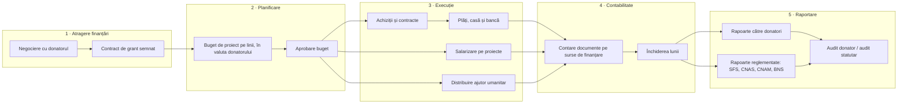
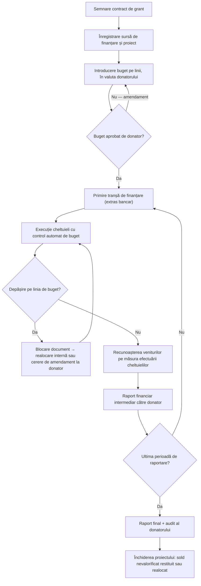
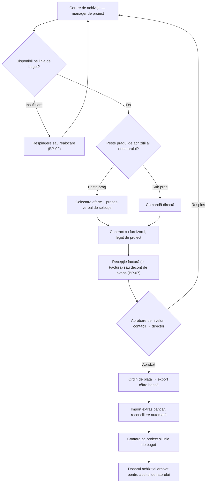
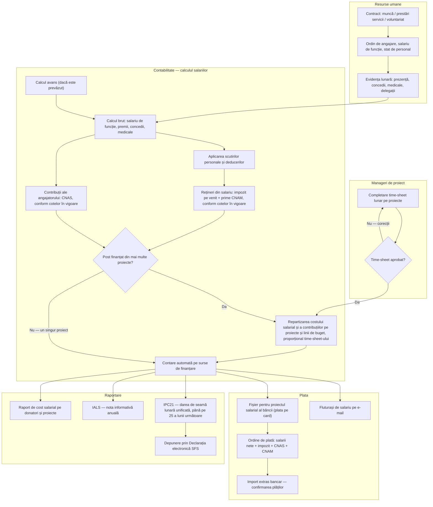
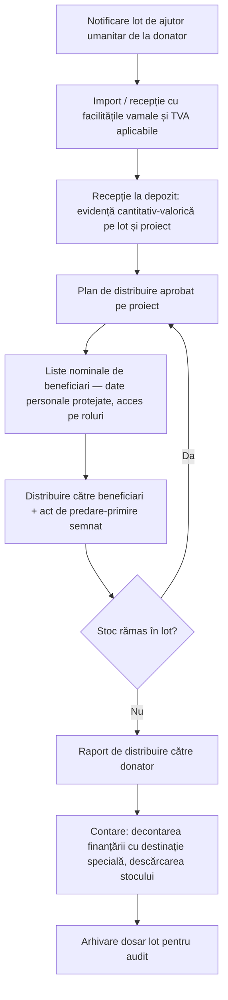
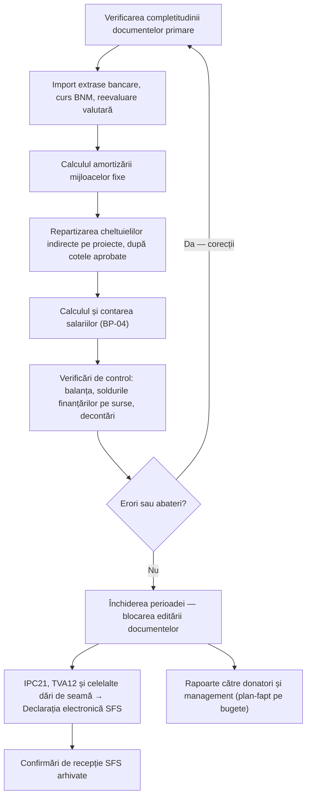

# Catalogul proceselor de business — UNA.md/ONG

**Configurația:** UNA.md/ONG — Contabilitatea Organizației Necomerciale (UNA.md ERP · Oracle Database 26ai · OCI)
**Ediția:** 2026 · Diagrame în notația Mermaid (redate nativ de GitHub)

Acest catalog însoțește fișa de produs `modul-contabilitate-ong-una-oracle.html` (secțiunea 15) și poate fi folosit ca bază pentru manualul de proceduri interne al organizației.

## Registrul proceselor

| Cod | Proces | Responsabil principal | Frecvență | Subsistem (fișa de produs, secț. 4) |
|-----|--------|----------------------|-----------|--------------------------------------|
| BP-00 | Harta generală a proceselor (de la donator la raportare) | Director executiv | continuu | toate |
| BP-01 | Ciclul de viață al grantului | Manager de proiect + contabil-șef | per contract | 4.1, 4.9 |
| BP-02 | Bugetare și realocări între linii de buget | Manager de proiect | per proiect / la amendamente | 4.9 |
| BP-03 | De la achiziție la plată (Procure-to-Pay) | Contabil + director | zilnic | 4.3, 4.7 |
| BP-04 | **Salarizare pe proiecte** (time-sheets, calcul, plată, IPC21) | Contabil salarii | lunar | 4.6 |
| BP-05 | Recepția și distribuirea ajutorului umanitar | Gestionar depozit + manager de proiect | per lot | 4.5 |
| BP-06 | Închiderea lunii și raportarea reglementată | Contabil-șef | lunar | 4.2, secț. 5 |
| BP-07 | Deconturi de avans și delegații | Titular de avans + contabil | la eveniment | 4.3 |
| BP-08 | Actualizare legislativă (Monitorul Oficial → OTRS → producție) | Partener de suport | la modificări | secț. 12.1 |

---

## BP-00 · Harta generală a proceselor

---

## BP-01 · Ciclul de viață al grantului

---

## BP-03 · De la achiziție la plată (Procure-to-Pay)

---

## BP-04 · Salarizare pe proiecte — procesul detaliat

Procesul-cheie pentru ONG-urile cu posturi finanțate din mai multe granturi: costul salarial se repartizează pe proiecte strict după time-sheets, iar dările de seamă pleacă electronic la SFS.

**Controale încorporate în BP-04:**

- suma repartizărilor pe proiecte = 100 % din costul salarial;
- blocarea calculului dacă lipsește time-sheet-ul aprobat;
- verificarea încadrării în linia de buget „Personal" a fiecărui proiect înainte de contare;
- jurnalul modificărilor pentru auditul donatorului.

---

## BP-05 · Recepția și distribuirea ajutorului umanitar

---

## BP-06 · Închiderea lunii și raportarea reglementată

---

*Document informativ, ediția 2026. Toate procesele sunt acoperite de configurația standard UNA.md/ONG; adaptările specifice organizației se realizează prin Grok Builder (opțional).*
