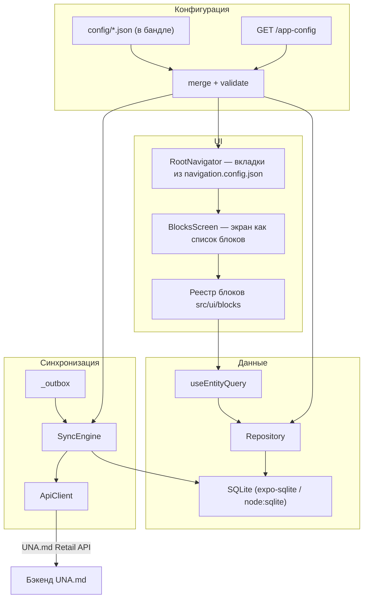
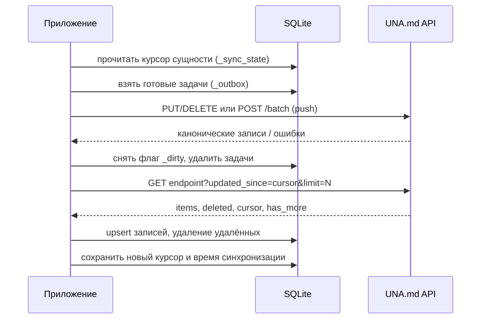
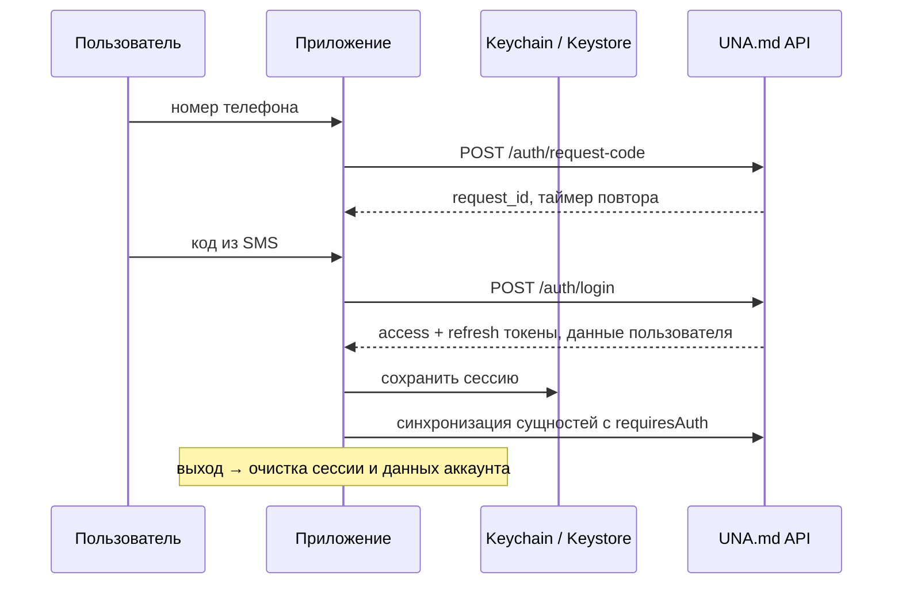

# Архитектура

## Слои

UI никогда не ходит в сеть напрямую: экран читает локальную базу, а сеть — это
отдельный фоновый процесс синхронизации. Поэтому приложение открывается мгновенно
и одинаково работает в метро и в магазине без покрытия.

## Поток данных при открытии главной

1. `BlocksScreen` берёт `config.screens.home` и рендерит блоки по их `type`.
2. Каждый блок отдаёт свой `source` (JSON-запрос) в `useEntityQuery`.
3. `Repository` компилирует запрос в SQL (`buildSelect`), проверяя имена колонок по
   схеме сущности, и выполняет его на SQLite.
4. Строки декодируются в записи: `localized`/`json` разбираются, `boolean` приводится
   к `true`/`false`.
5. После синхронизации счётчик `dataVersion` увеличивается, и хуки перезапрашивают
   данные.

## Синхронизация

Порядок «сначала push, потом pull» важен: иначе только что изменённая локально запись
была бы перетёрта прежней копией с сервера.

Особенности:

- **Дельта.** Курсор — значение `cursorField` (обычно `updated_at`) самой свежей
  полученной записи. Сервер может вернуть свой `cursor`; если нет — клиент вычислит его сам.
- **Полная загрузка.** Для небольших справочников (`banners`, `stores`, `loyalty_account`)
  каждый раз приходит вся коллекция; всё, чего в ответе не было, удаляется — через
  временную таблицу идентификаторов, чтобы не упереться в лимит параметров SQLite.
- **Конфликты.** По умолчанию выигрывает сервер: ответ на push записывается поверх
  локальной строки. `client_wins` оставляет локальные значения и просто снимает флаг
  `_dirty`.
- **Повторы.** Задача, которую не удалось отправить, ждёт `backoffMs × factor^(n-1)`;
  после `maxAttempts` она удаляется, а причина попадает в `_sync_state.last_error` и
  видна пользователю в блоке «Синхронизация».
- **Одновременные запуски.** Второй вызов `sync()` присоединяется к уже идущему.
- **Автозапуск.** При старте (если `sync.syncOnStart`), по интервалу и при возврате
  приложения из фона, если данные устарели.

## Личный кабинет

- Токен лежит в системном хранилище (`expo-secure-store`); там, где его нет (веб,
  часть эмуляторов), используется таблица `_kv` — реализация выбирается автоматически.
- `AuthService` — единственное место, где создаётся и уничтожается сессия; API-клиент
  берёт токен через `TokenProvider`, а движок синхронизации спрашивает у него же,
  авторизован ли пользователь.
- Одновременные `401` разделяют один запрос на обновление токена; запросы к `/auth/*`
  не пытаются обновлять токен, иначе обновление ждало бы само себя.
- Выход удаляет таблицы, курсоры и очереди всех сущностей с `requiresAuth`, поэтому
  чужие чеки и карта не остаются на общем устройстве.

## Схема базы

Таблицы генерируются из `entities.config.json`. К объявленным колонкам добавляются две
служебные:

- `_synced_at` — когда строка пришла с сервера;
- `_dirty` — есть ли локальные изменения, ещё не отправленные (такие строки защищены
  от удаления при синхронизации).

Служебные таблицы (префикс `_` зарезервирован):

| Таблица | Назначение |
|---------|-----------|
| `_kv` | настройки, токен, кэш удалённой конфигурации, отпечатки схемы |
| `_sync_state` | курсор, время последней синхронизации, последняя ошибка, число записей |
| `_outbox` | очередь исходящих изменений (сущность, операция, полезная нагрузка, попытки) |
| `_search_history` | последние поисковые запросы |

### Миграции

Для каждой таблицы хранится отпечаток (FNV-1a от её структуры). При старте и при
применении новой конфигурации:

| Ситуация | Действие |
|----------|----------|
| отпечатка нет | таблица создаётся |
| отпечаток совпал | ничего |
| отпечаток изменился | таблица пересоздаётся, курсор сбрасывается — данные приедут заново |
| сущность исчезла из конфигурации | таблица, курсор и её очередь удаляются |

Серверные таблицы — это кэш, поэтому их безопасно пересоздавать. Незапушенные
пользовательские изменения живут в `_outbox`, который не трогается.

## Драйверы SQLite

Весь код работает через интерфейс `SqlDriver` (`execute`, `select`, `transaction`):
на устройстве — `expo-sqlite`, в тестах и CLI — встроенный в Node `node:sqlite`.
Благодаря этому 89 тестов, включая end-to-end, гоняют настоящую базу и настоящий
движок синхронизации без эмулятора.

## Безопасность

- Значения в SQL всегда параметризованы, имена колонок проверяются по схеме сущности:
  конфигурация (в том числе присланная сервером) не может выполнить произвольный SQL.
- Удалённая конфигурация применяется только после полной валидации.
- Токен сейчас лежит в `_kv`; для продакшена его следует перенести в
  `expo-secure-store` — точка замены одна, `TokenProvider` в `src/bootstrap.ts`.
