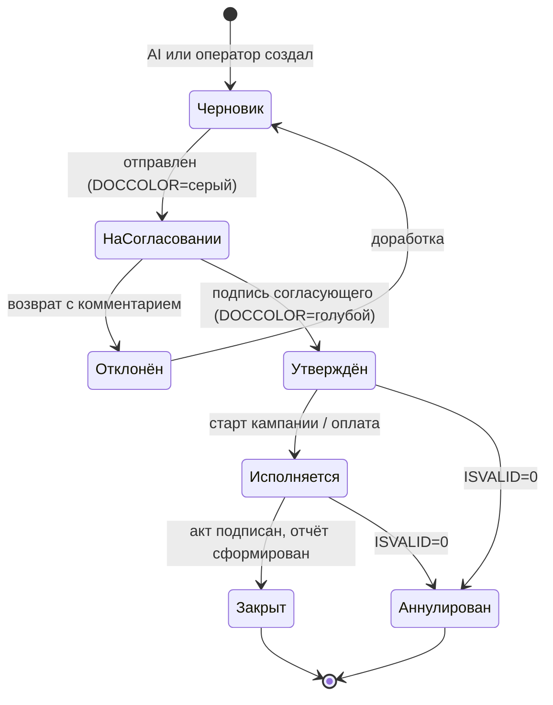
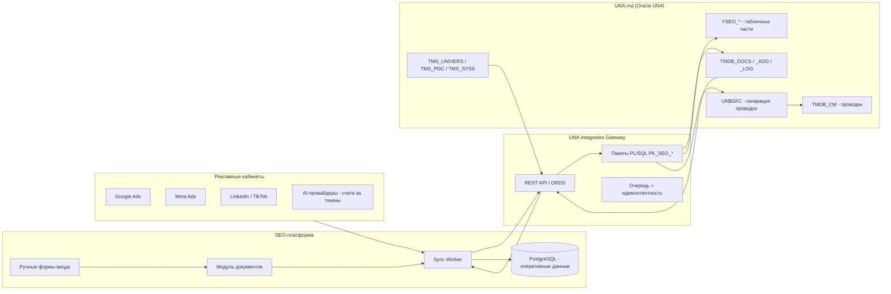

# Техническое задание (часть II)
## Модуль документооборота и учёта маркетинга на базе платформы UNA.md

| Параметр | Значение |
|---|---|
| Версия | 1.0 |
| Дата | 2026-08-24 |
| Родительский документ | [`TZ-SEO-AI-Platform.md`](./TZ-SEO-AI-Platform.md) |
| Учётное ядро | **UNA.md** (Oracle, схема `UN4`) |
| Источник структуры БД | https://bsoft.gitbook.io/wiki/razrabotka/obekty-oracle/struktura-bazy-dannykh |
| Юрисдикция учёта | Республика Молдова (НСБУ / SNC, Налоговый кодекс РМ) |

---

## 20. Назначение модуля

SEO-платформа из части I управляет **процессом продвижения**. Данный модуль добавляет
**полноценный документооборот и финансовый учёт этого процесса**, при этом:

> **Единственным источником истины по деньгам и юридически значимым документам является UNA.md.**
> SEO-платформа не ведёт «свою параллельную бухгалтерию». Она формирует документы,
> отправляет их в UNA, читает оттуда факт и строит план/факт-аналитику.

Что это даёт:
- маркетинговые расходы попадают в один контур с общей бухгалтерией предприятия;
- договоры с агентствами/блогерами/площадками, акты, счета, платежи — оформлены по закону РМ;
- бюджет на рекламу планируется, согласовывается, расходуется и контролируется в одном месте;
- каждый пост, акция, размещение имеет учётный документ с себестоимостью;
- считается реальный ROI канала: `выручка из канала ÷ фактические затраты по проводкам`.

### 20.1 Два режима работы (обязательны оба)

| Режим | Как работает | Когда применяется |
|---|---|---|
| **A. Интеграция** | Платформа создаёт/читает документы UNA через API-слой (§23). Проводки формируются штатными алгоритмами UNA. | Основной режим. Все типовые операции. |
| **B. Ручной ввод** | Оператор вводит документ в панели платформы (или в клиенте UNA), данные синхронизируются. | Нет API у контрагента; нестандартная операция; работа офлайн; исправление ошибок; период до готовности интеграции. |

Ни одна сущность не должна существовать **только** в режиме A. Для каждого типа документа
обязательна ручная экранная форма — это требование приёмки (§29).

---

## 21. Проекция на структуру БД UNA

Модуль **не изобретает новую модель данных** — он использует существующие соглашения UNA.

### 21.1 Используемые существующие объекты

| Объект UNA | Роль в модуле маркетинга |
|---|---|
| `TMDB_DOCS` | Шапка любого маркетингового документа (`COD`, `SYSFID` = тип, `DATAMANUAL`, `NRMANUAL`, `USERID`, `DOCCOLOR`, `DIV`, `ISVALID`) |
| `TMDB_DOCS_ADD` | Дополнительные атрибуты документа (1:1) — ссылки на кампанию, канал, URL публикации |
| `TMDB_DOCS_LOG` | История движения/согласования документа (сохраняется даже после удаления документа) |
| `TMDB_CM` | Бухгалтерские проводки по документу (`DT`/`CT`, `DTSC`/`CTSC`, `SUMA`, `SUMAVALDT`, `VALUTADT`, `DTDIV`/`CTDIV`, `FUNCT`) |
| `TMDB_ST201M` / `TMDB_ST201D` | Шапка + табличная часть универсального документа — база для документов, где не нужна отдельная Y-таблица |
| `TMS_UNIVERS` | Универсальный справочник: контрагенты (`TIP='OE'`), сотрудники (`OR`), банки (`OBANK`), услуги/номенклатура (`M`/`P`) |
| `TMS_ORG` | Расширение 1:1 для организаций — реквизиты агентств, площадок, подрядчиков |
| `TMS_PDC` | План счетов — счета затрат на маркетинг, расчётов, НДС |
| `TMS_SYSS` / `TMS_SYSSV` | Системные справочники-разделы: каналы продвижения, типы акций, статусы, валюты (`S,3`) |
| `TMS_SYSGR` / `TMS_SYSGRPH` / `TMS_SYSGRP` | Деревья группировки: дерево каналов, дерево кампаний, дерево сайтов |
| `TMS_UM` | Единицы измерения нетиповых услуг (показ, клик, пост, сутки размещения, символ) |
| `TPR0M_PRICES`, `TPR2D_PRLIST` | Прайс-листы площадок и подрядчиков с периодами действия |
| `UN4SYS_DATA` | Описание новых документов (`DOCS`), отчётов (`REPORTS`), прав (`RIGHTS`), настроек (`SETUPS`) в INI-формате |
| `X$CHGLOG`, `X$CHGLOG_VALUE` | Аудит изменений маркетинговых документов |
| `UN$CM`, `UN$SUMA` | Пользовательские типы для аналитики проводки и мультивалютной суммы |

### 21.2 Новые объекты (префикс `YSEO_`)

Согласно соглашению UNA, таблицы, специфичные для конкретного предприятия/контура,
именуются `Y[ABBR]_`. Аббревиатура контура — **`SEO`**.

| Таблица | Назначение | Первичный ключ |
|---|---|---|
| `YSEO_TMS_SITE` | Справочник продвигаемых сайтов (расширение `TMS_UNIVERS` 1:1, `TIP='W'`) | `COD` |
| `YSEO_TMS_PLATFORM` | Справочник площадок размещения (расширение `TMS_UNIVERS` 1:1 для `TIP='OE'`) | `COD` |
| `YSEO_TMDB_CAMP_D` | Табличная часть документа «Кампания/Акция»: этапы, каналы, плановые суммы | `NRDOC, NRDOC1` |
| `YSEO_TMDB_BUDG_D` | Табличная часть документа «Бюджет»: статья, канал, период, план-сумма | `NRDOC, NRDOC1` |
| `YSEO_TMDB_POST_D` | Табличная часть документа «Реестр публикаций»: канал, URL, дата, стоимость | `NRDOC, NRDOC1` |
| `YSEO_TMDB_PLACE_D` | Табличная часть документа «Размещение/медиаплан»: площадка, формат, период, тариф | `NRDOC, NRDOC1` |
| `YSEO_TMDB_ADSPEND_D` | Строки документа «Расход на рекламу» (импорт из Google Ads/Meta): день, кампания, показы, клики, сумма | `NRDOC, NRDOC1` |
| `YSEO_METRICS_FACT` | Факт по метрикам продвижения (позиции, трафик, лиды) для расчёта эффективности | `SITE_COD, CHANNEL_ID, DT` |
| `YSEO_XREF` | Кросс-таблица соответствия сущностей платформы и UNA (idempotent-синхронизация) | `EXT_SYSTEM, EXT_ID` |
| `YSEO_TMDB_CONTRACT_D` | Условия договора: этапы, KPI, суммы, сроки | `NRDOC, NRDOC1` |

Обязательные требования к новым таблицам (по соглашениям UNA §«Ключевые соглашения проектирования»):
- внешние ключи — с `ON DELETE CASCADE` и `DEFERRABLE INITIALLY DEFERRED`;
- отдельный индекс по полям FK;
- полный первичный ключ родителя включается в PK дочерней таблицы;
- удаление из справочников — только флагом `ISARHIV`, не `DELETE`;
- для каждой таблицы — вьюшка `VSEO_*` (или `V` + имя) с вычисляемыми полями формата `CLC[Field]T`;
- периодические данные — `DATASTART` + расчётный `DATAEND` через вьюшку.

### 21.3 Новые справочники в `TMS_SYSS`

| `TIP`,`COD` | Раздел | Содержание `COD1` / `DENUMIREA` |
|---|---|---|
| `W`,1 | Каналы продвижения | Google Organic, Google Ads, Facebook, Instagram, LinkedIn, TikTok, YouTube, Telegram, point.md, 999.md, Email, PR |
| `W`,2 | Типы маркетинговых документов | Бюджет, Кампания, Медиаплан, Договор, Акт, Счёт, Публикация, Расход рекламы, Отчёт |
| `W`,3 | Статусы согласования | Черновик, На согласовании, Утверждён, Отклонён, Исполняется, Закрыт, Аннулирован |
| `W`,4 | Типы акций/промо | Скидка %, Скидка сумма, Подарок, Пакет, Бесплатный период, Промокод, Конкурс |
| `W`,5 | Форматы размещения | Статья, Баннер, Пост, Сторис, Видео, Пресс-релиз, Объявление, Рассылка |
| `W`,6 | Статьи маркетингового бюджета | Контекстная реклама, Таргет, Контент, Линкбилдинг, PR, Инструменты/подписки, AI-токены, Подряд, Прочее |
| `W`,7 | Единицы закупки медиа | CPC, CPM, CPA, Fix, Сутки, Пост, Символ |

Для каждого раздела заполняется `TMS_SYSSV` (заголовки столбцов `VCOD1`, `VDENUMIREA`,
`VNUMBER1`, `VNUMBER2`, `VPRET` и ссылки `SCTIP1`/`SCCOD1`).

### 21.4 Аналитика проводок

| Уровень аналитики | Поле в `TMDB_CM` | Что хранит |
|---|---|---|
| Подразделение | `DTDIV` / `CTDIV` | **Сайт** (una.md / unisim-soft / officeplus.md) — основной разрез затрат |
| Субконто | `DTSC` / `CTSC` | Контрагент (агентство, площадка, блогер) или сотрудник |
| Субконто 1 | `DTSC1` / `CTSC1` | **Канал продвижения** (из `TMS_SYSS` `W`,1) |
| Строковая аналитика | `DTSTRSC` / `CTSTRSC` | Код кампании (`CAMP-2026-08-BACKTOOFFICE`) |
| Ссылка на документ | `DTNRDOC` / `CTNRDOC` | Связь с документом-основанием (договор, счёт) |
| Валюта | `VALUTADT` / `VALUTACT`, `SUMAVALDT` / `SUMAVALCT` | Расчёты в USD/EUR (Google, Meta) |
| Группировка | `FUNCT` | Функция проводки: `MKTPLAN`, `MKTACC`, `MKTPAY`, `MKTVAT`, `MKTFX` |

> Такой разрез даёт готовые отчёты «затраты по сайту × каналу × кампании» стандартными
> средствами UNA (`UN$G_PIVOT`, `UN$G_RG1P12`) без написания отдельной BI-системы.

---

## 22. Типы документов модуля

Каждый тип регистрируется в `UN4SYS_DATA` (секция `DOCS`, INI-формат) и получает свой `SYSFID`.

### 22.1 Реестр документов

| # | `SYSFID` (предл.) | Документ | Табличная часть | Формирует проводки | Уровень автономии AI |
|---|---|---|---|---|---|
| D1 | `WSEO01` | **Маркетинговый бюджет** (год/квартал/месяц) | `YSEO_TMDB_BUDG_D` | Нет (плановый) | L1 — AI готовит проект, человек утверждает |
| D2 | `WSEO02` | **Кампания / Акция** | `YSEO_TMDB_CAMP_D` | Нет (организационный) | L1 |
| D3 | `WSEO03` | **Медиаплан / План размещений** | `YSEO_TMDB_PLACE_D` | Нет | L1 |
| D4 | `WSEO04` | **Договор с подрядчиком/площадкой** | `YSEO_TMDB_CONTRACT_D` | Нет (учёт обязательств) | L0 — только человек |
| D5 | `WSEO05` | **Заявка на расход** (заявка на оплату) | `TMDB_ST201D` | Нет | L1 |
| D6 | `WSEO06` | **Акт выполненных работ / Proces-verbal** | `TMDB_ST201D` | **Да** — признание расхода | L1 |
| D7 | `WSEO07` | **Счёт-фактура полученная / Factura fiscala** | `TMDB_ST201D` | **Да** — расход + НДС | L1 |
| D8 | `WSEO08` | **Расход на рекламу** (импорт из рекламных кабинетов) | `YSEO_TMDB_ADSPEND_D` | **Да** | L3 — автоимпорт, ревью постфактум |
| D9 | `WSEO09` | **Платёж / Ordin de plata** | `TMDB_ST201D` | **Да** — погашение задолженности | L0 — только человек |
| D10 | `WSEO10` | **Реестр публикаций за период** | `YSEO_TMDB_POST_D` | Нет (регистрационный) | L2 |
| D11 | `WSEO11` | **Отчёт о размещении** (закрывает медиаплан) | `YSEO_TMDB_PLACE_D` | Нет | L2 |
| D12 | `WSEO12` | **Отчёт об эффективности** (план/факт + KPI) | — | Нет | L2 |
| D13 | `WSEO13` | **Начисление НДС по импорту услуг** | `TMDB_ST201D` | **Да** | L1 (с обязательной проверкой бухгалтера) |
| D14 | `WSEO14` | **Переоценка валютной задолженности** | — | **Да** | L1 |
| D15 | `WSEO15` | **Списание AI-токенов / подписок на инструменты** | `TMDB_ST201D` | **Да** | L1 |

### 22.2 Обязательные реквизиты шапки (все типы)

| Поле | Источник | Обязательность |
|---|---|---|
| `COD` | Последовательность UNA | авто |
| `SYSFID` | Тип документа | обяз. |
| `DATAMANUAL` | Дата документа | обяз. |
| `NRMANUAL` | Номер (нумератор по типу+году, через `UN$G$UTIL.TextIncrement`) | обяз. |
| `DIV` | **Сайт** | обяз. |
| `USERID` | Автор (человек или технический пользователь AI-сессии) | обяз. |
| `DOCCOLOR` | Визуальный статус: жёлтый — черновик/AI, серый — на согласовании, голубой — утверждён | обяз. |
| `ISVALID` | Флаг деактивации (аннулирование без удаления) | обяз. |
| `TMDB_DOCS_ADD.CAMP_COD` | Кампания | если применимо |
| `TMDB_DOCS_ADD.CHANNEL_ID` | Канал | если применимо |
| `TMDB_DOCS_ADD.RUN_ID` | ID AI-сессии, породившей документ | если создан AI |
| `TMDB_DOCS_ADD.PLAYBOOK_SHA` | Git SHA плейбука-основания | если создан AI |

> Поля `RUN_ID` и `PLAYBOOK_SHA` — принципиальны: они связывают финансовый документ
> с конкретным исполнением конкретной версии плейбука. Полная прослеживаемость
> «плейбук → действие → публикация → расход → проводка → отчёт».

### 22.3 Маршрут согласования (workflow)



Правила:
- каждый переход пишется в `TMDB_DOCS_LOG` (кто, когда, из какого статуса, комментарий);
- матрица согласования настраивается по сумме и типу: до 5 000 MDL — SEO-менеджер;
  5 000–50 000 MDL — руководитель маркетинга; свыше 50 000 MDL — директор + главный бухгалтер;
- **AI-сессия никогда не является согласующим** — только автором черновика;
- документ, формирующий проводки, не может быть проведён без статуса «Утверждён»;
- аннулирование — только `ISVALID=0`, физическое удаление запрещено.

---

## 23. Интеграция SEO-платформы с UNA

### 23.1 Архитектура интеграции



### 23.2 Слой доступа

**Запрещено:** прямой INSERT/UPDATE в таблицы UNA из внешней системы.
**Разрешено:** только через пакеты PL/SQL в схеме `UN4PUBLIC` (или `UN4`), опубликованные наружу через ORDS/REST.

| Пакет | Процедуры/функции |
|---|---|
| `PK_SEO_DOC` | `CREATE_DOC`, `UPDATE_DOC`, `SUBMIT`, `APPROVE`, `REJECT`, `CANCEL`, `GET_DOC`, `LIST_DOCS` |
| `PK_SEO_BUDGET` | `SET_BUDGET`, `GET_PLAN_FACT`, `CHECK_LIMIT` (проверка лимита до создания расходного документа) |
| `PK_SEO_SPEND` | `IMPORT_ADSPEND` (идемпотентная загрузка расходов рекламных кабинетов по дню/кампании) |
| `PK_SEO_REF` | `UPSERT_PLATFORM`, `UPSERT_CONTRACTOR`, `GET_CHANNELS`, `GET_ACCOUNTS` |
| `PK_SEO_POST` | `REGISTER_PUBLICATION` (регистрация факта публикации с URL и стоимостью) |
| `PK_SEO_REPORT` | `RPT_PLAN_FACT`, `RPT_CHANNEL_COST`, `RPT_ROI`, `RPT_CONTRACTOR` |
| `PK_SEO_METRIC` | `PUSH_METRICS` (позиции, трафик, лиды — в `YSEO_METRICS_FACT`) |

Требования к пакетам:
- использовать `GET_ENV` вместо `SYS_CONTEXT` (соглашение UNA);
- ошибки — через `MSG` (`RAISE_APPLICATION_ERROR`), предупреждения — через `WARN`;
- числовые операции — через `NNN` / `S2N`;
- генерация проводок — исключительно через `UN$GFC`, не ручными INSERT в `TMDB_CM`;
- каждая процедура-мутатор принимает `p_ext_id` и `p_ext_system` для идемпотентности
  (повтор вызова с тем же `ext_id` не создаёт дубликат, а возвращает существующий `COD`).

### 23.3 Идемпотентность и синхронизация

Таблица `YSEO_XREF`:

| Поле | Тип | Описание |
|---|---|---|
| `EXT_SYSTEM` | VARCHAR2(32) | `seoplatform`, `googleads`, `meta`, `linkedin`, `anthropic` |
| `EXT_ID` | VARCHAR2(128) | Идентификатор во внешней системе |
| `UNA_TABLE` | VARCHAR2(64) | Целевая таблица UNA |
| `UNA_COD` | NUMBER | `COD` документа / `COD` справочника |
| `HASH` | VARCHAR2(64) | Хеш содержимого для обнаружения изменений |
| `SYNCED_AT` | DATE | Время последней синхронизации |
| `DIRECTION` | CHAR(1) | `I` — в UNA, `O` — из UNA, `B` — двусторонняя |

Правила синхронизации:
1. **Справочники** (контрагенты, счета, каналы) — мастер в UNA, платформа только читает и кэширует.
2. **Плановые документы** (бюджет, кампания, медиаплан) — мастер в платформе, отправляются в UNA.
3. **Финансовые документы** (счета, акты, платежи) — мастер в UNA; платформа создаёт черновик, но правки бухгалтера в UNA имеют приоритет и подтягиваются обратно.
4. Конфликт (изменено с двух сторон) — не решается автоматически: создаётся задача оператору с diff.
5. Периодичность: справочники — 1 раз/час, документы — событийно + сверка раз в сутки.
6. Ежесуточная **сверка контрольных сумм**: количество и сумма документов за период в платформе = в UNA. Расхождение → алерт.

### 23.4 Ручной ввод (режим B) — обязательные формы

| Форма | Поля | Валидация |
|---|---|---|
| Бюджет | Сайт, период, статья, канал, сумма, валюта | Сумма > 0; период не пересекается с существующим бюджетом по той же статье |
| Кампания/Акция | Название, код, сайт(ы), период, тип акции, механика, целевой KPI, плановый бюджет | Код уникален; период ≥ 1 день; бюджет ≤ остатка по статье |
| Договор | Контрагент, номер, дата, предмет, сумма, валюта, срок, условия оплаты, KPI | Контрагент существует в `TMS_UNIVERS` (`TIP='OE'`) с заполненным IDNO |
| Акт/Счёт | Договор, период, услуга, количество, цена, сумма, НДС | Сумма ≤ остатку по договору; НДС по ставке контрагента |
| Публикация | Сайт, канал, площадка, URL, дата, формат, стоимость, кампания | URL валиден и доступен (проверка HEAD-запросом); дата ≤ сегодня |
| Размещение | Площадка, формат, период, тариф, единица закупки, сумма | Тариф сверяется с прайс-листом `TPR2D_PRLIST`, отклонение > 15% требует комментария |
| Расход рекламы | Канал, кабинет, день, кампания, показы, клики, сумма, валюта | Нет дубля по (кабинет, день, кампания) |
| Платёж | Документ-основание, банк, дата, сумма, валюта, курс | Сумма ≤ непогашенному остатку обязательства |

Требования к формам:
- автозаполнение из справочников UNA (поиск с автодополнением по `TMS_UNIVERS`);
- вложения: скан счёта/акта/договора → в S3, ссылка в `TMDB_DOCS_ADD`;
- распознавание вложенного счёта AI-сессией с предзаполнением полей (человек проверяет);
- черновик сохраняется локально и не попадает в UNA до отправки;
- полный аудит правок (`X$CHGLOG`).

---

## 24. Учёт акций и промо-механик

Требование: платформа хранит не только «пост», но и **коммерческую акцию** со всей механикой,
и связывает её с результатом.

### 24.1 Сущность «Акция» (документ D2, `YSEO_TMDB_CAMP_D`)

| Поле | Описание |
|---|---|
| `CAMP_CODE` | Уникальный код (`CAMP-2026-09-SCHOOL`) |
| `NAME_RU`, `NAME_RO`, `NAME_EN` | Названия |
| `SITE_COD` | Сайт (может быть несколько строк — мультисайтовая акция) |
| `PROMO_TYPE` | Тип из `TMS_SYSS` (`W`,4): скидка %, сумма, подарок, пакет, промокод, конкурс |
| `DISCOUNT_VALUE` | Значение скидки |
| `PROMO_CODE` | Промокод (если есть) |
| `SCOPE` | Область: весь сайт / категория / список товаров-услуг (ссылка на `TMS_UNIVERS`) |
| `DATE_START`, `DATE_END` | Период действия |
| `LIMIT_QTY`, `LIMIT_SUM` | Ограничения (количество применений, максимальная сумма скидок) |
| `BUDGET_PLAN` | Плановый бюджет продвижения акции |
| `KPI_TARGET` | Целевые показатели: лиды, заказы, выручка, ROAS |
| `LEGAL_TEXT_REF` | Ссылка на правила акции (обязательно для конкурсов/розыгрышей) |
| `STATUS` | Статус из `TMS_SYSS` (`W`,3) |

Связи:
- **Акция → Публикации**: `YSEO_TMDB_POST_D.CAMP_COD` — все посты по акции;
- **Акция → Медиаплан**: `YSEO_TMDB_PLACE_D.CAMP_COD` — все платные размещения;
- **Акция → Затраты**: `TMDB_CM.DTSTRSC = CAMP_CODE` — все проводки по акции;
- **Акция → Результат**: заказы/лиды из CRM или GA4 с UTM `utm_campaign = CAMP_CODE`.

### 24.2 Учёт скидки как расхода

Предоставленная скидка — это либо уменьшение выручки, либо расход на продвижение.
Модуль должен поддерживать **оба варианта учётной политики** (настройка на уровне предприятия):

| Вариант | Проводка | Когда |
|---|---|---|
| Уменьшение выручки | сторно `611` | Скидка предоставлена в момент продажи (стандарт для розницы) |
| Расход на распространение | `Дт 712 — Кт 611`/`832` | Маркетинговая акция с отдельным бюджетом, требуется отдельный контроль |

> Выбор варианта — решение главного бухгалтера предприятия. Платформа обязана
> поддержать оба и не навязывать один. Настройка хранится в `UN4SYS_DATA.SETUPS`.

### 24.3 Автоматизация от AI-сессии

Плейбук `60-campaign-launch` (новый шаблон в библиотеку части I):
1. Читает утверждённый документ «Акция» из UNA (`PK_SEO_DOC.GET_DOC`).
2. Проверяет остаток бюджета (`PK_SEO_BUDGET.CHECK_LIMIT`) — **если лимит исчерпан, сессия останавливается**.
3. Генерирует креативы и тексты под каждый канал с корректными UTM (`utm_campaign = CAMP_CODE`).
4. Готовит медиаплан → документ D3 в UNA (статус «Черновик»).
5. Ставит всё в Approval Inbox.
6. После утверждения — публикует и регистрирует каждый факт через `PK_SEO_POST.REGISTER_PUBLICATION`.
7. По завершении периода — плейбук `61-campaign-close`: собирает факт, формирует отчёт D12, инициирует акты.

---

## 25. Бюджетирование рекламы

### 25.1 Иерархия бюджета

```
Год (предприятие)
 └─ Сайт (DIV)
     └─ Квартал / Месяц
         └─ Статья бюджета (TMS_SYSS W,6)
             └─ Канал (TMS_SYSS W,1)
                 └─ Кампания (CAMP_CODE)
```

Каждый уровень имеет: `PLAN` (план), `COMMITTED` (законтрактовано договорами),
`ACTUAL` (факт по проводкам), `FORECAST` (прогноз до конца периода), `AVAILABLE` (доступно).

`AVAILABLE = PLAN − COMMITTED − ACTUAL`

### 25.2 Контроль лимитов (жёсткое требование)

| Правило | Поведение |
|---|---|
| Расходный документ превышает `AVAILABLE` | Блокировка проведения. Требуется документ «Корректировка бюджета» с согласованием на уровень выше |
| Расход достиг 80% бюджета статьи | Алерт ответственному |
| Расход достиг 100% | Автоматическая приостановка связанных AI-сессий, тратящих деньги (плейбуки с внешними платными действиями) |
| AI-сессия хочет запустить платное действие | Обязательный вызов `PK_SEO_BUDGET.CHECK_LIMIT` **до** действия |
| Перерасход обнаружен постфактум (данные кабинета пришли позже) | Документ создаётся, но помечается `OVERBUDGET`, уходит в отдельную очередь разбора |

### 25.3 Бюджет на AI-токены и инструменты

Отдельная статья бюджета — **`AI-токены и SaaS-инструменты`**. Требования:
- расход по каждой AI-сессии логируется в `task_runs.cost_json` (часть I) и агрегируется помесячно;
- инвойс AI-провайдера/SEO-сервиса разносится документом D15 с распределением
  по сайтам пропорционально фактическому потреблению токенов;
- в отчёте по ROI канала стоимость AI-работы включается в затраты — иначе экономика искажена;
- лимит месячного расхода на токены задаётся на уровне сайта; при достижении — сессии останавливаются.

### 25.4 Мультивалютность

Реклама у Google/Meta/LinkedIn покупается в USD/EUR. Требования:
- сумма хранится в валюте (`SUMAVALDT`/`VALUTADT`) и в MDL по курсу НБМ на дату операции;
- курс тянется автоматически из справочника валют (`TMS_SYSS` `S`,3) с загрузкой курса НБМ;
- ежемесячная переоценка валютной задолженности (документ D14) с отнесением
  курсовых разниц на доходы/расходы;
- в отчётности предусмотрен переключатель «в валюте документа / в MDL».

---

## 26. Налоговые особенности Республики Молдова

> **Раздел носит характер требований к функциональности, а не налоговой консультации.**
> Конкретные ставки, счета и формы подлежат обязательной сверке с главным бухгалтером
> предприятия и действующей редакцией Налогового кодекса РМ на дату внедрения.
> Система должна делать эти правила **настраиваемыми**, а не «зашитыми в код».

### 26.1 Что обязана учитывать система

| Ситуация | Требование к системе |
|---|---|
| Покупка рекламы у нерезидента (Google, Meta, LinkedIn, TikTok, AI-провайдеры) | Автоматическое формирование документа D13 «НДС по импорту услуг» с настраиваемой ставкой и счетами; напоминание о сроке уплаты |
| Налог у источника с дохода нерезидента | Флаг на контрагенте «нерезидент» + настраиваемая ставка удержания + признак применения соглашения об избежании двойного налогообложения (с хранением сертификата резидентства и срока его действия) |
| Услуги от резидента-плательщика НДС | Разнесение НДС к вычету на основании `Factura fiscala` с обязательным контролем наличия оригинала документа |
| Услуги от резидента-неплательщика НДС | Без НДС, контроль по флагу плательщика в `TMS_ORG` |
| Оплата физлицу (блогер, фрилансер) | Признак типа контрагента + расчёт удержаний и взносов по настраиваемым правилам + выгрузка данных для отчётности |
| Расходы, не вычитаемые в налоговых целях | Флаг на статье бюджета и на документе; отдельный регистр для налогового учёта |
| Валютные операции | Переоценка, курсовые разницы, контроль валютного законодательства |
| Электронная счёт-фактура (`e-Factura`) | Интеграция или как минимум ручная привязка номера e-Factura к документу |

### 26.2 Реквизиты контрагента (`TMS_ORG`, обязательные для маркетинга)

`IDNO` / налоговый номер, признак резидентства, признак плательщика НДС, юридический адрес,
банковские реквизиты (IBAN, SWIFT), валюта расчётов, срок отсрочки платежа,
статус сертификата резидентства (номер, дата, срок), ответственное контактное лицо,
ссылка на договор, оценка качества (для площадок — из части I: траст, тематичность, трафик).

---

## 27. Схемы типовых проводок

> Номера счетов приведены по общей логике Национальных стандартов бухгалтерского учёта РМ
> и **являются настраиваемыми параметрами**, а не константами. Перед внедрением
> сверяются с рабочим планом счетов предприятия (`TMS_PDC`).

| # | Операция | Дт | Кт | Аналитика | `FUNCT` |
|---|---|---|---|---|---|
| 1 | Признан расход на рекламу/продвижение (акт, счёт) | `712` (расходы на распространение) | `521` (торговые обязательства) | `DTDIV`=сайт, `DTSC1`=канал, `DTSTRSC`=кампания, `CTSC`=контрагент | `MKTACC` |
| 2 | НДС к вычету по счёту резидента | счёт учёта НДС к вычету | `521` | `CTSC`=контрагент | `MKTVAT` |
| 3 | Предоплата за рекламу на будущий период | `261` (расходы будущих периодов) | `521` | период списания | `MKTACC` |
| 4 | Ежемесячное списание предоплаченного размещения | `712` | `261` | по графику | `MKTACC` |
| 5 | Оплата поставщику услуг | `521` | `242` / `243` (текущие счета) | `DTSC`=контрагент, банк | `MKTPAY` |
| 6 | Начислен НДС по импорту услуг нерезидента | счёт расчётов по НДС (вычет) | счёт обязательств по НДС | контрагент-нерезидент | `MKTVAT` |
| 7 | Удержан налог у источника с нерезидента | `521` | счёт обязательств перед бюджетом | контрагент, вид налога | `MKTVAT` |
| 8 | Курсовая разница (отрицательная) по валютной задолженности | счёт финансовых расходов | `521` | валюта, дата курса | `MKTFX` |
| 9 | Курсовая разница (положительная) | `521` | счёт финансовых доходов | валюта, дата курса | `MKTFX` |
| 10 | Расход на AI-токены / SaaS-инструменты | `712` или `713` (по политике) | `521` | распределение по сайтам | `MKTACC` |
| 11 | Оплата блогеру-физлицу | `521` / счёт расчётов с физлицами | `242` | физлицо, удержания | `MKTPAY` |
| 12 | Скидка по акции как расход на продвижение (вариант политики) | `712` | счёт учёта скидок | кампания | `MKTACC` |
| 13 | Внутреннее распределение затрат маркетинга между сайтами | `712`/сайт-получатель | `712`/сайт-источник | база распределения | `MKTALLOC` |

Все схемы реализуются **настройками генератора проводок `UN$GFC`**, а не хардкодом.
Изменение плана счетов или учётной политики не должно требовать доработки кода.

---

## 28. Отчётность модуля

| Код | Отчёт | Содержание | Получатель |
|---|---|---|---|
| R1 | **План/факт бюджета** | По сайту × статье × каналу × периоду: план, законтрактовано, факт, остаток, % освоения | Руководитель маркетинга |
| R2 | **Затраты по каналам** | Сумма затрат в разрезе каналов с динамикой месяц к месяцу | Руководитель |
| R3 | **Эффективность канала (ROI/ROAS)** | Затраты (проводки) vs результат (лиды/заказы/выручка из GA4+CRM) по каналу и кампании | Руководитель, владелец |
| R4 | **Отчёт по кампании/акции** | Полный паспорт акции: бюджет, размещения, публикации, охваты, лиды, выручка, ROI | Руководитель |
| R5 | **Реестр публикаций** | Все публикации за период: канал, площадка, URL, стоимость, метрики | SEO-менеджер |
| R6 | **Расчёты с подрядчиками** | Задолженность, авансы, закрытые/незакрытые акты, просроченные обязательства | Бухгалтерия |
| R7 | **Стоимость AI-работы** | Расход токенов по сайтам, плейбукам, сессиям; стоимость единицы результата (статьи, поста) | Владелец |
| R8 | **Незакрытые документы** | Счета без актов, акты без оплаты, медиапланы без отчётов о размещении | Бухгалтерия, менеджер |
| R9 | **Налоговый регистр по маркетингу** | Вычитаемые/невычитаемые расходы, НДС по импорту услуг, удержания по нерезидентам | Главный бухгалтер |
| R10 | **Сверка платформа ↔ UNA** | Расхождения по количеству и суммам документов | Администратор |

Технически отчёты строятся средствами UNA (`UN$G_PIVOT`, `UN$G_RG1P12`, вьюшки `VSEO_*`)
и дублируются в панели платформы через `PK_SEO_REPORT`. R3, R4 и R7 дополнительно
формируются AI-сессией с текстовыми выводами и рекомендациями (плейбук `52-monthly-report`
расширяется финансовым блоком).

---

## 29. Расширение библиотеки плейбуков (фаза 6)

| Код | Название | Что делает | Автономия |
|---|---|---|---|
| `60-campaign-launch` | Запуск акции | Читает утверждённую акцию из UNA, проверяет бюджет, готовит креативы, медиаплан, UTM | L1/L2 |
| `61-campaign-close` | Закрытие акции | Собирает факт, считает ROI, формирует отчёт D12, инициирует акты | L1 |
| `62-budget-draft` | Проект бюджета | Готовит проект бюджета на период на основе истории затрат и результатов | L1 |
| `63-adspend-import` | Импорт расходов | Тянет расходы из рекламных кабинетов, создаёт D8, сверяет с инвойсами | L3 |
| `64-invoice-intake` | Приём счетов | Распознаёт входящий счёт/акт, предзаполняет D6/D7, находит договор-основание | L1 |
| `65-contractor-review` | Оценка подрядчиков | Считает эффективность каждого подрядчика/площадки: затраты vs результат | L1 |
| `66-doc-hygiene` | Гигиена документов | Ищет незакрытые/просроченные документы, формирует задачи (отчёт R8) | L2 |
| `67-plan-fact-alert` | Контроль бюджета | Ежедневная проверка освоения бюджета, алерты при 80/100% | L3 |

Каждый плейбук фазы 6 **обязан** содержать в разделе Guardrails:

```markdown
## Ограничения (финансовый контур)
- НЕ проводить документы. AI создаёт только черновики со статусом «Черновик».
- НЕ изменять уже утверждённые или проведённые документы.
- НЕ создавать платёжные документы (D9) — только человек.
- НЕ трогать справочники UNA (контрагенты, план счетов) — только чтение.
- ОБЯЗАТЕЛЬНО вызвать PK_SEO_BUDGET.CHECK_LIMIT перед любым действием, влекущим расход.
- ОБЯЗАТЕЛЬНО передавать p_ext_id для идемпотентности — повторный запуск не создаёт дублей.
- При любом расхождении сумм > 1% — остановиться и вынести на решение человеку.
- Секреты подключения к Oracle НЕ передаются в playbook, только secret_ref.
```

---

## 30. Безопасность финансового контура

| Требование | Реализация |
|---|---|
| Разделение доступа | AI-сессии работают под техническим пользователем UNA с правами: чтение справочников, создание черновиков. Без прав на проведение, оплату, изменение справочников |
| Права в UNA | Настраиваются в `UN4SYS_DATA.RIGHTS` штатным механизмом, не обходятся через API |
| Четыре глаза | Документы с денежным эффектом: автор ≠ согласующий. Платёж — минимум два согласующих сверх порога |
| Аудит | `X$CHGLOG` + `X$CHGLOG_VALUE` на всех `YSEO_*` и маркетинговых `TMDB_*`; триггеры генерируются через `P$CHGLOG_MAKE_TRIGGER` |
| Неизменяемость истории | `TMDB_DOCS_LOG` без FK — история сохраняется после удаления документа |
| Секреты | Только Oracle Wallet / Vault. Ни строки подключения, ни паролей в `.md` плейбуках |
| Сеть | Gateway между платформой и Oracle; прямой доступ к 1521 из интернета запрещён |
| Ограничение на суммы | Технический предел на сумму документа, создаваемого AI (например, 10 000 MDL); выше — только ручной ввод |
| Anti-fraud | Алерты: новый контрагент + сразу крупный платёж; изменение банковских реквизитов существующего контрагента; дублирующиеся счета по сумме и дате |

---

## 31. Дополнения к дорожной карте

| Этап | Содержание документооборота |
|---|---|
| **M1 (MVP)** | Справочники (сайты, площадки, каналы), ручные формы всех документов, `YSEO_XREF`, чтение из UNA |
| **M2** | Документы D1–D3, D10 (бюджет, кампания, медиаплан, реестр публикаций), контроль лимитов |
| **M3** | Документы D4–D9 (договоры, акты, счета, платежи, импорт расходов), генерация проводок через `UN$GFC`, отчёты R1–R6 |
| **M4** | D13–D15 (налоговый блок, переоценка, AI-токены), отчёты R7–R10, плейбуки фазы 6, e-Factura |

---

## 32. Критерии приёмки модуля

1. Все 15 типов документов заведены в `UN4SYS_DATA`, доступны и в клиенте UNA, и в web-панели.
2. Для **каждого** типа документа работает ручной ввод — независимо от наличия интеграции.
3. Ни один документ не проводится без прохождения маршрута согласования; AI не может быть согласующим.
4. Проводки формируются исключительно через `UN$GFC` по настройкам; план счетов меняется без правки кода.
5. Контроль бюджета блокирует перерасход и останавливает платные AI-сессии при исчерпании лимита.
6. Импорт расходов из рекламных кабинетов идемпотентен: повторный запуск за тот же период не создаёт дублей (проверяется тестом).
7. Ежесуточная сверка «платформа ↔ UNA» проходит с нулевым расхождением; расхождение порождает алерт.
8. Мультивалютные операции корректно пересчитываются по курсу НБМ, переоценка формирует курсовые разницы.
9. Отчёт R3 (ROI канала) сходится: сумма затрат по каналам = сумме проводок по счёту `712` за период в разрезе `DTSC1`.
10. Каждый финансовый документ, созданный AI, прослеживается до `RUN_ID` и `PLAYBOOK_SHA`.
11. Аудит `X$CHGLOG` фиксирует все изменения; удаление документов невозможно (только `ISVALID=0`).
12. Технический пользователь AI не имеет прав на проведение, платежи и правку справочников (проверяется тестом на превышение прав).
13. Соблюдены все соглашения UNA по именованию, FK, вьюшкам и вычисляемым полям (code review со стороны команды UNA).
14. Главный бухгалтер подтвердил корректность схем проводок и налоговых настроек на тестовом периоде.

---

## 33. Открытые вопросы (требуют решения заказчика)

| # | Вопрос | Почему важно |
|---|---|---|
| Q1 | Рабочий план счетов предприятия: какие именно счета и субсчета использовать для маркетинга? | Без этого схемы §27 остаются шаблоном |
| Q2 | Учётная политика по скидкам: уменьшение выручки или расход на продвижение? | Влияет на отчётность и налоги |
| Q3 | Есть ли у UNA.md готовый REST/ORDS-слой, или Gateway разрабатывается с нуля? | Существенно влияет на сроки M3 |
| Q4 | Ведётся ли учёт по нескольким юрлицам (una.md, unisim-soft, officeplus.md — одно предприятие или разные)? | Определяет: одна схема UN4 или несколько |
| Q5 | Порядок распределения общих маркетинговых затрат между сайтами (если юрлицо одно) | Нужна база распределения |
| Q6 | Пороги согласования в MDL | Настройка матрицы согласования |
| Q7 | Используется ли e-Factura и есть ли к ней программный доступ | Объём интеграции |
| Q8 | Максимальная сумма документа, который вправе создать AI | Настройка §30 |
| Q9 | Какие рекламные кабинеты подключаются в первую очередь | Приоритет разработки коннекторов |
| Q10 | Требуется ли отдельный налоговый регистр по невычитаемым расходам | Объём отчёта R9 |

---

**Конец документа.**
