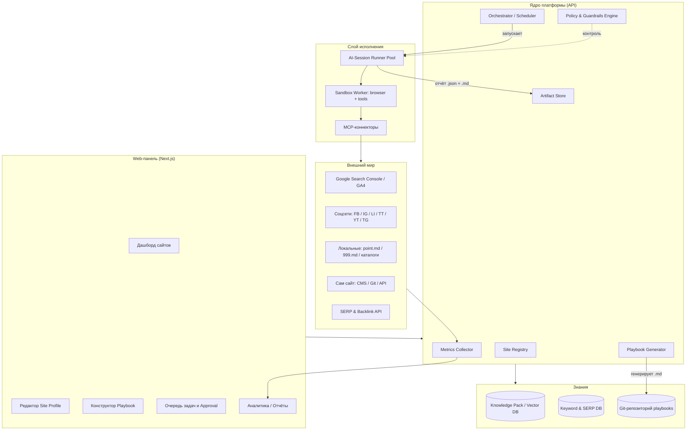

# Техническое задание
## Web-платформа AI-SEO продвижения кастомных сайтов
### Кодовое имя: **SEOForge** (рабочее)

| Параметр | Значение |
|---|---|
| Версия документа | 1.0 |
| Дата | 2026-08-24 |
| Заказчик | UNISIM-SOFT SRL (Республика Молдова) |
| Пилотные проекты | `una.md`, `unisim-soft.com` (unisim-soft), `officeplus.md` |
| Язык интерфейса | RU / RO / EN |
| Статус | Черновик для согласования |

---

## 1. Резюме (Executive Summary)

Платформа представляет собой **web-систему управления SEO и digital-продвижением произвольного количества собственных сайтов**, где вся «интеллектуальная» работа выполняется не человеком-маркетологом, а **автономными AI-сессиями**, получающими на вход **исполняемые Markdown-файлы (`.md`-плейбуки)**.

Ключевая идея:

> Платформа **не пишет тексты сама** и **не публикует посты напрямую**.
> Платформа **генерирует детерминированные, версионируемые `.md`-инструкции** («AI-Runbook»), которые запускаются в изолированных AI-сессиях (Claude Code / Agent SDK и аналоги). Каждая сессия — это отдельный «SEO-специалист», который читает `.md`, выполняет задачи, отчитывается результатом обратно в платформу.

Такой подход даёт:
- **Прозрачность** — каждый шаг продвижения задокументирован в человекочитаемом `.md`;
- **Воспроизводимость** — тот же `.md` даст тот же процесс через полгода;
- **Масштабируемость** — 3 сайта или 300 сайтов, разница только в количестве запущенных сессий;
- **Аудит** — git-история `.md`-файлов = история SEO-стратегии;
- **Независимость от подрядчиков** — знания живут в репозитории, а не в голове маркетолога.

---

## 2. Цели и бизнес-задачи

### 2.1 Цели проекта

| # | Цель | Метрика успеха (12 мес.) |
|---|---|---|
| C1 | Вывести пилотные сайты в ТОП-10 Google.md/Google.ro по целевым коммерческим запросам | ≥ 60% приоритетных ключей в ТОП-10 |
| C2 | Обеспечить постоянный органический трафик без платной рекламы | +300% органики к базовой точке |
| C3 | Автоматизировать 80% рутины SEO (аудит, мета, контент-план, линкбилдинг, постинг) | Ручных часов/мес ≤ 20 на сайт |
| C4 | Присутствие в локальных площадках Молдовы (`point.md`, `999.md`, каталоги) | ≥ 25 качественных локальных упоминаний на сайт |
| C5 | Управляемость: единая панель для N сайтов | Добавление нового сайта ≤ 30 мин до первого запуска сессии |
| C6 | Соответствие требованиям поисковиков (E-E-A-T, Helpful Content, AI-Overviews/GEO) | 0 ручных санкций, попадание в AI-ответы Google/Perplexity |

### 2.2 Целевые сайты (пилот)

| Сайт | Тематика | Гео | Основные задачи |
|---|---|---|---|
| **una.md** | ERP/учётная система, бухгалтерия для НКО и бизнеса, B2B SaaS | MD, RO | Коммерческие запросы «программа бухгалтерия Молдова», «ERP Moldova», контент-маркетинг для бухгалтеров, экспертный блог |
| **unisim-soft** | Разработка ПО, IT-услуги, интеграции | MD, EU | B2B-лидогенерация, кейсы, техноблог, англоязычный сегмент |
| **officeplus.md** | Офисные товары / офисное оборудование / услуги (e-commerce) | MD | Товарные и категорийные запросы, локальный SEO, маркетплейсы, товарные фиды |

> Платформа архитектурно **не привязана** к этим трём сайтам — любой новый сайт добавляется как конфигурация (Site Profile).

### 2.3 Вне рамок проекта (Out of scope, v1)

- Разработка/редизайн самих сайтов (платформа только выдаёт рекомендации и патчи);
- Платная реклама (Google Ads, Meta Ads) — только модуль аналитики пересечения с органикой;
- Полностью автоматическая публикация без человеческого подтверждения на этапе v1 (см. §9 Human-in-the-loop);
- Накрутка поведенческих факторов, PBN, серые/чёрные методы — **запрещены политикой платформы** (§14).

---

## 3. Глоссарий

| Термин | Определение |
|---|---|
| **Site Profile** | Конфигурационная сущность одного продвигаемого сайта: домен, тематика, гео, tone of voice, доступы, KPI |
| **Playbook (`.md`)** | Сгенерированный платформой Markdown-файл с инструкцией для AI-сессии: контекст, задачи, ограничения, формат отчёта |
| **AI-Session (Runner)** | Изолированный запуск AI-агента, который читает playbook и выполняет его |
| **Task Run** | Конкретное исполнение playbook'а: id, статус, логи, артефакты, стоимость токенов |
| **Artifact** | Результат сессии: текст статьи, набор мета-тегов, патч кода, JSON-отчёт, список площадок |
| **Channel** | Канал продвижения: Google Organic, Facebook, Instagram, LinkedIn, TikTok, YouTube, Telegram, point.md, 999.md, каталоги |
| **GEO / AEO** | Generative Engine Optimization / Answer Engine Optimization — оптимизация под AI-ответы (Google AI Overviews, ChatGPT Search, Perplexity) |
| **Knowledge Pack** | Векторизованная база знаний по сайту: продукты, УТП, факты, тональность, запреты |
| **Approval Gate** | Точка обязательного человеческого подтверждения перед внешним действием |

---

## 4. Архитектура системы

### 4.1 Общая схема



### 4.2 Компоненты

#### 4.2.1 Web-панель (Frontend)
- **Стек:** Next.js 15 (App Router), React 19, TypeScript, TailwindCSS, shadcn/ui, TanStack Query, Recharts.
- Мультиязычность (`next-intl`): RU / RO / EN.
- Роли: Owner, SEO-Manager, Content-Editor, Viewer, Client (read-only отчёты).
- Обязательные экраны: см. §6.

#### 4.2.2 Backend API
- **Стек:** Node.js 22 + NestJS (или FastAPI/Python — решается на этапе прототипа), REST + WebSocket (live-логи сессий).
- **БД:** PostgreSQL 16 (+ `pgvector` для Knowledge Pack), Redis (очереди/кэш), S3-совместимое хранилище (артефакты, скриншоты, медиа).
- **Очередь:** BullMQ / Temporal — оркестрация длинных многошаговых сценариев с retry и человеческими паузами.
- **Auth:** OAuth2 + OIDC, 2FA обязательно для ролей с доступом к публикации.

#### 4.2.3 Playbook Generator
Ядро ценности продукта. Собирает `.md` из:
1. **Site Profile** (кто мы, что продаём, кому, тон);
2. **Стратегического слоя** (текущая фаза: аудит → семантика → контент → линкбилдинг → удержание);
3. **Данных** (актуальные позиции, GSC-запросы, конкуренты, пробелы контента);
4. **Шаблона задачи** (Playbook Template из библиотеки, §7);
5. **Guardrails** (что запрещено, лимиты, обязательные проверки).

Результат — детерминированный, самодостаточный `.md` (см. §8 — формат).

#### 4.2.4 Orchestrator
- Планировщик (cron + событийный): «еженедельный аудит», «при падении позиции >5 — запустить диагностику», «при новой статье — запустить дистрибуцию по каналам».
- Управление параллелизмом, бюджетом токенов, приоритетами.
- Dependency-graph: playbook B стартует только после успешного A.

#### 4.2.5 AI-Session Runner
- Каждая сессия — изолированный контейнер (Docker/Firecracker) с:
  - смонтированным playbook `.md`;
  - доступом к нужным MCP-коннекторам (по принципу минимальных привилегий);
  - headless-браузером (Playwright/Chromium) для проверки SERP и работы с площадками без API;
  - лимитом времени, токенов и сетевых доменов (allowlist).
- Модели: конфигурируемо (Claude Opus/Sonnet как основной, дешёвые модели для рутинных проверок).
- Обязательный выход сессии: `report.json` + `report.md` + артефакты.

#### 4.2.6 MCP-коннекторы (Tool Layer)
| Коннектор | Назначение | Тип |
|---|---|---|
| `mcp-gsc` | Google Search Console: запросы, позиции, CTR, индексация, отправка на переобход | API |
| `mcp-ga4` | Google Analytics 4: трафик, конверсии, поведение | API |
| `mcp-gbp` | Google Business Profile: посты, отзывы, NAP | API |
| `mcp-serp` | Съём выдачи (Google.md/.ro/.com), AI Overviews, PAA | API (DataForSEO / Serper / собств. парсер) |
| `mcp-backlinks` | Ahrefs / Majestic / OpenPageRank — ссылочный профиль | API |
| `mcp-site` | Доступ к самому сайту: CMS API, Git-репозиторий, WordPress REST, sitemap, robots | API/Git |
| `mcp-social` | Публикация и метрики: Facebook/Instagram Graph, LinkedIn, YouTube Data, TikTok, Telegram Bot | API |
| `mcp-local-md` | Молдавские площадки: point.md, 999.md, makler.md, каталоги, локальные СМИ | API/браузер |
| `mcp-crawler` | Технический краулер (Lighthouse, Core Web Vitals, битые ссылки, дубли) | Внутр. |
| `mcp-lang` | Проверка RO/RU орфографии, читаемости, диакритики | Внутр. |

#### 4.2.7 Policy & Guardrails Engine
Проверяет **до** внешнего действия:
- нет запрещённых утверждений (юридические/медицинские/финансовые гарантии);
- соблюдение бренд-словаря и запретных слов;
- отсутствие плагиата (проверка уникальности);
- лимиты частоты постинга по каналам (анти-спам);
- обязательное раскрытие AI-генерации там, где требует площадка;
- GDPR / Закон РМ №133 о персональных данных.

---

## 5. Функциональные требования

### 5.1 FR-1. Управление сайтами (Site Registry)

| ID | Требование | Приоритет |
|---|---|---|
| FR-1.1 | Добавление сайта: домен, язык(и), гео, CMS/стек, доступы (OAuth/токены/ключи) | MUST |
| FR-1.2 | Site Profile: ниша, продукты/услуги, УТП, ЦА и персоны, конкуренты, tone of voice, стоп-слова, юридические ограничения | MUST |
| FR-1.3 | Автоматический онбординг-аудит при добавлении сайта (запуск playbook `00-onboarding-audit`) | MUST |
| FR-1.4 | Подключение GSC/GA4 в 2 клика (OAuth) | MUST |
| FR-1.5 | Импорт Knowledge Pack: загрузка PDF/DOCX/URL → векторизация | SHOULD |
| FR-1.6 | Клонирование настроек одного сайта в другой (шаблон агентства) | SHOULD |
| FR-1.7 | Мультиязычные версии сайта как под-профили (una.md/ru, una.md/ro) с раздельной семантикой и hreflang-контролем | MUST |

### 5.2 FR-2. Семантика и исследование

| ID | Требование | Приоритет |
|---|---|---|
| FR-2.1 | Сбор семантического ядра: GSC + внешние источники + конкуренты + AI-расширение | MUST |
| FR-2.2 | Кластеризация ключей по SERP-пересечению (а не только по лексике) | MUST |
| FR-2.3 | Определение интента (informational / commercial / transactional / navigational / local) | MUST |
| FR-2.4 | Приоритизация: объём × сложность × коммерческая ценность × текущая позиция (score-модель) | MUST |
| FR-2.5 | Content Gap: чего нет у нас, но есть у ТОП-10 конкурентов | MUST |
| FR-2.6 | Учёт локальной специфики: смешанный RU/RO поиск, транслит, диакритика (`contabilitate` vs `contabilitate` без диакритики) | MUST |
| FR-2.7 | Карта «ключ → URL» с обнаружением каннибализации | MUST |
| FR-2.8 | Мониторинг запросов, по которым сайт попадает в AI Overviews / AI-ответы | SHOULD |

### 5.3 FR-3. Технический SEO

| ID | Требование | Приоритет |
|---|---|---|
| FR-3.1 | Регулярный краул: 4xx/5xx, редиректы, дубли, canonical, sitemap, robots.txt | MUST |
| FR-3.2 | Core Web Vitals (LCP/INP/CLS) — полевые (CrUX) + лабораторные (Lighthouse) | MUST |
| FR-3.3 | Валидация структурированных данных (Organization, Product, Article, FAQPage, BreadcrumbList, LocalBusiness, SoftwareApplication) | MUST |
| FR-3.4 | Проверка индексации и логов сервера (частота обхода ботами, в т.ч. GPTBot/ClaudeBot/PerplexityBot) | SHOULD |
| FR-3.5 | Генерация **патчей** для сайта: git-diff / PR в репозиторий сайта или изменение через CMS API | MUST |
| FR-3.6 | `llms.txt` и AI-friendly разметка для генеративных движков | SHOULD |
| FR-3.7 | Контроль hreflang и мультиязычных дублей | MUST |

### 5.4 FR-4. Контент-модуль

| ID | Требование | Приоритет |
|---|---|---|
| FR-4.1 | Контент-план на 1–12 месяцев с привязкой к кластерам и воронке | MUST |
| FR-4.2 | Генерация брифов (структура H1–H3, ключи, интент, обязательные факты, длина, CTA) | MUST |
| FR-4.3 | Генерация черновиков статей AI-сессией с опорой на Knowledge Pack (антигаллюцинационный режим: любой факт о продукте — только из базы) | MUST |
| FR-4.4 | Обязательный Approval Gate: человек утверждает перед публикацией (v1) | MUST |
| FR-4.5 | Проверка уникальности и «AI-водянистости», редполитика E-E-A-T (авторство, экспертиза, источники) | MUST |
| FR-4.6 | Мультиязычный вывод: RU→RO→EN с адаптацией, а не машинным переводом | MUST |
| FR-4.7 | Обновление устаревшего контента (Content Refresh) по сигналу падения позиций | SHOULD |
| FR-4.8 | Генерация медиа: схемы (Mermaid/SVG), обложки, alt-тексты | SHOULD |

### 5.5 FR-5. Внешнее продвижение и каналы

| ID | Требование | Приоритет |
|---|---|---|
| FR-5.1 | Реестр площадок продвижения с оценкой качества (траст, тематичность, посещаемость, гео) | MUST |
| FR-5.2 | Локальные площадки Молдовы: **point.md**, 999.md, makler.md, Yellow Pages MD, отраслевые каталоги, локальные медиа | MUST |
| FR-5.3 | Соцсети: Facebook, Instagram, LinkedIn, Telegram, YouTube, TikTok — адаптация одного материала под форматы каждой сети | MUST |
| FR-5.4 | Google Business Profile: посты, Q&A, работа с отзывами | MUST |
| FR-5.5 | Календарь публикаций с учётом локальных праздников/сезонности РМ | SHOULD |
| FR-5.6 | Аутрич: поиск площадок, генерация персонализированных писем, трекинг ответов | SHOULD |
| FR-5.7 | Мониторинг упоминаний бренда и незалинкованных упоминаний | SHOULD |
| FR-5.8 | Для e-commerce (officeplus.md): товарные фиды (Google Merchant, локальные маркетплейсы) | SHOULD |

### 5.6 FR-6. Playbook-подсистема (ключевая)

| ID | Требование | Приоритет |
|---|---|---|
| FR-6.1 | Библиотека шаблонов playbook'ов (§7) с версионированием | MUST |
| FR-6.2 | Генерация конкретного `.md` под конкретный сайт + момент времени + данные | MUST |
| FR-6.3 | Хранение всех сгенерированных `.md` в Git (репозиторий на сайт), diff между версиями | MUST |
| FR-6.4 | Визуальный конструктор playbook'а (блоки: контекст / задачи / инструменты / критерии приёмки / формат отчёта) | SHOULD |
| FR-6.5 | Dry-run: прогон playbook'а без внешних действий (только чтение) | MUST |
| FR-6.6 | Оценка стоимости запуска (токены, API-вызовы) до старта | SHOULD |
| FR-6.7 | Возможность ручного редактирования `.md` перед запуском | MUST |
| FR-6.8 | Playbook как экспортируемый артефакт: можно скачать и запустить в своём Claude Code вне платформы | MUST |

### 5.7 FR-7. Исполнение AI-сессий

| ID | Требование | Приоритет |
|---|---|---|
| FR-7.1 | Запуск сессии: ручной, по расписанию, по триггеру (событие/метрика) | MUST |
| FR-7.2 | Live-лог сессии в UI (WebSocket), пошаговое отображение действий агента | MUST |
| FR-7.3 | Пауза/остановка/повтор сессии; возобновление с контрольной точки | MUST |
| FR-7.4 | Изоляция: сессия видит только свой сайт и свои доступы | MUST |
| FR-7.5 | Лимиты: время, токены, деньги, количество внешних запросов | MUST |
| FR-7.6 | Approval Gate внутри сессии: агент останавливается и ждёт подтверждения человека | MUST |
| FR-7.7 | Полный аудит-трейл каждого внешнего действия (что, куда, когда, кем санкционировано) | MUST |
| FR-7.8 | Параллельный запуск сессий по нескольким сайтам с общим лимитом бюджета | MUST |

### 5.8 FR-8. Аналитика и отчётность

| ID | Требование | Приоритет |
|---|---|---|
| FR-8.1 | Дашборд: позиции, видимость, органический трафик, конверсии, ссылки, доля голоса | MUST |
| FR-8.2 | Трекинг позиций: Google.md, Google.ro, Google.com; desktop/mobile; RU/RO | MUST |
| FR-8.3 | Атрибуция: «этот playbook → эти публикации → этот прирост трафика» | SHOULD |
| FR-8.4 | Автоотчёт клиенту/руководству (PDF/HTML) раз в месяц, генерируется AI-сессией | MUST |
| FR-8.5 | Алерты: падение позиций, потеря индексации, 5xx, просадка CWV, негативный отзыв | MUST |
| FR-8.6 | ROI-калькулятор: расход (токены+API+часы) vs результат (лиды/выручка из органики) | SHOULD |

---

## 6. Экраны Web-панели

| # | Экран | Содержание |
|---|---|---|
| S1 | **Обзор портфеля** | Плитки сайтов: видимость, трафик, дельта за 30 дней, активные сессии, алерты |
| S2 | **Сайт → Обзор** | KPI, график позиций, воронка, последние публикации, здоровье техSEO |
| S3 | **Сайт → Профиль** | Site Profile, доступы, Knowledge Pack, guardrails, tone of voice |
| S4 | **Семантика** | Таблица ключей, кластеры, интенты, карта «ключ→URL», каннибализация |
| S5 | **Контент-план** | Календарь + канбан (Идея → Бриф → Черновик → На утверждении → Опубликовано → Обновить) |
| S6 | **Playbooks** | Библиотека шаблонов, сгенерированные `.md`, git-история, конструктор, кнопка «Запустить» |
| S7 | **Сессии** | Список Task Run, статусы, live-логи, стоимость, артефакты, повтор |
| S8 | **Approval Inbox** | Очередь на утверждение: тексты, посты, патчи, письма аутрича — с diff и кнопками Approve/Edit/Reject |
| S9 | **Каналы** | Подключённые соцсети/площадки, лимиты, календарь публикаций, метрики по каналам |
| S10 | **Техаудит** | Список проблем по severity, автопатчи, статус PR в репозиторий сайта |
| S11 | **Ссылки** | Ссылочный профиль, новые/потерянные, аутрич-пайплайн, дисавоу-кандидаты |
| S12 | **Отчёты** | Конструктор отчётов, история, шаринг клиенту |
| S13 | **Настройки** | Пользователи, роли, бюджеты, модели, интеграции, аудит-лог |

---

## 7. Библиотека Playbook-шаблонов

Каждый шаблон — параметризованный `.md`. Ниже — обязательный набор v1.

### 7.1 Фаза 0 — Онбординг
| Код | Название | Периодичность |
|---|---|---|
| `00-onboarding-audit` | Полный стартовый аудит: техника, контент, ссылки, конкуренты, позиции | 1 раз |
| `01-knowledge-extraction` | Извлечение УТП/продуктов/фактов с сайта в Knowledge Pack | 1 раз + при изменениях |
| `02-competitor-map` | Карта 5–10 конкурентов: их семантика, контент, ссылки, соцсети | 1 раз / квартал |

### 7.2 Фаза 1 — Семантика и стратегия
| Код | Название | Периодичность |
|---|---|---|
| `10-keyword-harvest` | Сбор и расширение семядра | Ежемесячно |
| `11-serp-clustering` | Кластеризация по SERP + определение интента | Ежемесячно |
| `12-content-gap` | Поиск контентных пробелов против ТОП-10 | Ежемесячно |
| `13-strategy-quarter` | Квартальная стратегия: приоритеты, гипотезы, план | Ежеквартально |

### 7.3 Фаза 2 — Технический SEO
| Код | Название | Периодичность |
|---|---|---|
| `20-tech-crawl` | Краул + отчёт по ошибкам | Еженедельно |
| `21-cwv-optimize` | Диагностика и патчи Core Web Vitals | Ежемесячно |
| `22-schema-org` | Генерация/проверка микроразметки | По изменениям |
| `23-indexation-watch` | Контроль индексации, orphan-страницы, sitemap | Еженедельно |
| `24-ai-readiness` | `llms.txt`, доступность для AI-краулеров, цитируемость в AI-ответах | Ежемесячно |

### 7.4 Фаза 3 — Контент
| Код | Название | Периодичность |
|---|---|---|
| `30-content-brief` | Бриф на статью/страницу по кластеру | По плану |
| `31-article-draft` | Черновик материала (RU) с фактчекингом по Knowledge Pack | По плану |
| `32-localize-ro` | Адаптация на румынский (не перевод — локализация) | По плану |
| `33-commercial-page` | Коммерческая/категорийная/товарная страница | По плану |
| `34-content-refresh` | Обновление проседающего контента | Триггер |
| `35-eeat-boost` | Авторские профили, экспертиза, источники, About/Trust-страницы | Ежеквартально |

### 7.5 Фаза 4 — Дистрибуция и каналы
| Код | Название | Периодичность |
|---|---|---|
| `40-social-repurpose` | Один материал → посты под FB/IG/LI/TG/TikTok/YouTube Shorts | По публикации |
| `41-local-md-placement` | Размещение на point.md / 999.md / каталогах MD | Еженедельно |
| `42-gbp-manage` | Google Business Profile: посты, Q&A, отзывы | Еженедельно |
| `43-outreach` | Поиск доноров + персонализированный аутрич | Ежемесячно |
| `44-pr-digest` | Питчи в локальные IT/бизнес-медиа | Ежемесячно |
| `45-community` | Ответы на профильных форумах/группах (экспертно, без спама) | Еженедельно |

### 7.6 Фаза 5 — Контроль и отчётность
| Код | Название | Периодичность |
|---|---|---|
| `50-rank-track` | Съём позиций и анализ дельт | Ежедневно/еженедельно |
| `51-anomaly-diagnose` | Диагностика просадки (алгоритм / техника / конкурент / сезон) | Триггер |
| `52-monthly-report` | Отчёт за месяц с выводами и планом | Ежемесячно |
| `53-backlink-audit` | Аудит ссылочного, токсичные ссылки | Ежемесячно |

---

## 8. Формат Playbook `.md` (спецификация)

### 8.1 Требования к формату

1. Файл **самодостаточен** — агент не нуждается во внешнем контексте кроме указанных инструментов.
2. **YAML front-matter** — машиночитаемые метаданные.
3. Строгая структура секций (парсится платформой).
4. Явные **критерии приёмки** и **формат отчёта**.
5. Явные **запреты** и **лимиты**.
6. Идемпотентность: повторный запуск не создаёт дубликатов.

### 8.2 Каноническая структура

````markdown
---
playbook_id: 31-article-draft
version: 3.2.0
site: una.md
site_locale: [ru-MD, ro-MD]
generated_at: 2026-08-24T09:00:00Z
run_mode: execute            # dry-run | execute
model_hint: claude-opus-5
budget:
  max_tokens: 400000
  max_minutes: 45
  max_external_calls: 60
tools_allowed:
  - mcp-site
  - mcp-serp
  - mcp-gsc
  - mcp-lang
network_allowlist:
  - una.md
  - google.com
  - search.google.com
approval_required: true
approval_stage: before_publish
outputs:
  - artifacts/article-draft.md
  - artifacts/meta.json
  - report.json
---

# Задача: черновик статьи по кластеру «программа для бухгалтерии НКО»

## 1. Контекст сайта
UNA.md — молдавская ERP/учётная система...
Целевая аудитория: главные бухгалтеры НКО и малого бизнеса РМ.
Tone of voice: экспертный, без маркетингового шума, с примерами из практики РМ.
Запретные утверждения: «полностью бесплатно», гарантии по срокам проверок,
любые трактовки налогового законодательства без ссылки на нормативный акт.

## 2. Входные данные
### 2.1 Кластер
| Ключ | Частота/мес | Текущая позиция | Интент |
|---|---|---|---|
| программа бухгалтерия НКО Молдова | 320 | 18 | commercial |
| contabilitate ONG program | 210 | — | commercial |
| ... | | | |

### 2.2 ТОП-10 конкурентов (снято 2026-08-23)
...

### 2.3 Факты о продукте (из Knowledge Pack, ID: kp-una-v7)
- Поддержка стандартов НКО РМ...
- Интеграция с ...
> ЛЮБОЙ факт о продукте берётся ТОЛЬКО отсюда. Если факта нет — пометь `[TODO: уточнить у заказчика]`.

## 3. Что нужно сделать
1. Проверить актуальную выдачу Google.md по главному ключу (`mcp-serp`).
2. Составить структуру статьи, перекрывающую интент лучше ТОП-3.
3. Написать черновик 1800–2500 слов на русском.
4. Подготовить мета-теги (title ≤ 60, description ≤ 155).
5. Предложить FAQPage-разметку (5 вопросов из PAA).
6. Предложить 3 внутренние ссылки на существующие страницы (проверить их наличие через `mcp-site`).

## 4. Ограничения (Guardrails)
- НЕ публиковать. Только черновик в artifacts/.
- НЕ выдумывать цифры, кейсы, отзывы, названия клиентов.
- НЕ копировать текст конкурентов (уникальность ≥ 92%).
- НЕ использовать клише «в современном мире», «динамично развивающийся».
- Диакритика румынского — обязательна, если пишется RO-версия.
- Соблюдать закон РМ №133 о персональных данных при любых примерах.

## 5. Критерии приёмки
- [ ] Структура покрывает все ключи кластера без переспама (плотность ≤ 2.5%)
- [ ] Каждое утверждение о продукте прослеживается до Knowledge Pack
- [ ] Есть минимум 2 практических примера/сценария
- [ ] Title и Description в пределах лимитов и содержат главный ключ
- [ ] Указаны источники для нормативных утверждений
- [ ] Заполнен `report.json` по схеме ниже

## 6. Формат отчёта (`report.json`)
```json
{
  "playbook_id": "31-article-draft",
  "run_id": "<uuid>",
  "status": "success | partial | failed | awaiting_approval",
  "artifacts": [{"path": "...", "type": "article|meta|schema"}],
  "metrics": {"words": 0, "uniqueness": 0.0, "keywords_covered": 0},
  "open_questions": ["..."],
  "next_actions": [{"playbook_id": "40-social-repurpose", "reason": "..."}],
  "cost": {"tokens_in": 0, "tokens_out": 0, "external_calls": 0}
}
```

## 7. Следующий шаг
После утверждения человеком — платформа автоматически поставит в очередь
`32-localize-ro` и `40-social-repurpose`.
````

### 8.3 Правила версионирования
- Шаблон: SemVer (`major` — несовместимое изменение структуры).
- Сгенерированный файл: `playbooks/<site>/<YYYY-MM>/<playbook_id>--<runid>.md`, коммитится в Git.
- Каждый Task Run ссылается на commit SHA своего `.md`.

---

## 9. Human-in-the-loop и уровни автономии

| Уровень | Название | Что делает AI | Что делает человек | Применение v1 |
|---|---|---|---|---|
| L0 | Advisory | Только анализ и рекомендации | Всё исполняет сам | Стратегия |
| L1 | Draft | Готовит черновики/патчи | Утверждает и публикует | **Контент, патчи сайта** |
| L2 | Supervised | Публикует после явного Approve | Одно нажатие Approve | **Соцсети, point.md** |
| L3 | Autonomous | Публикует сам в рамках guardrails | Постфактум-ревью | Только рутина: rank-tracking, отчёты, краулы |
| L4 | Full auto | Всё сам | Только алерты | **Не в v1** |

Правила:
- Любое **необратимое/публичное** действие в v1 — не выше L2.
- Аутрич-письма — всегда L2 (человек видит текст перед отправкой).
- Ответы на негативные отзывы — всегда L1.
- Изменения в production-коде сайта — только через PR, merge делает человек.

---

## 10. Специфика Молдовы (обязательный модуль)

### 10.1 Языковая модель рынка
- Реальный поиск смешанный: RU + RO + RO-без-диакритики + транслит.
- Обязательный учёт вариантов: `contabilitate` / `contabilitate` / «контабилитате».
- Раздельные семантические ядра и отдельные страницы для RU и RO, корректный `hreflang` (`ru-MD`, `ro-MD`, `x-default`).
- Румынский контент должен быть **локализован под РМ**, не под Румынию (валюта MDL, законодательство РМ, реалии).

### 10.2 Локальные площадки (реестр v1)
| Площадка | Тип | Ценность |
|---|---|---|
| **point.md** | Новостной портал + каталог + доска | Высокий траст, локальный трафик, брендовые упоминания |
| **999.md** | Доска объявлений №1 в РМ | Товарный трафик (критично для officeplus.md) |
| **makler.md** | Доска объявлений | Дополнительный охват |
| **Yellow Pages MD / anuar.md** | Бизнес-каталоги | NAP-консистентность, локальное SEO |
| **Локальные IT/бизнес-медиа** | PR | Экспертные ссылки для unisim-soft, una.md |
| **Профильные FB-группы РМ** | Комьюнити | Бухгалтеры, HR, предприниматели |
| **Google Business Profile** | Локальный поиск | Карты, «рядом со мной» |

> Для каждой площадки в системе хранится: правила публикации, лимиты частоты, требуемые форматы, наличие API, инструкция для агента (браузерный сценарий, если API нет).

### 10.3 Правовое
- Закон РМ №133/2011 «О защите персональных данных».
- GDPR — при работе с ЕС-аудиторией (unisim-soft).
- Правила площадок по автоматизации: где браузерная автоматизация запрещена ToS — только полуручной режим (агент готовит контент, человек публикует).

---

## 11. Стратегии по пилотным сайтам

### 11.1 una.md — B2B SaaS / ERP
- **Ядро стратегии:** экспертный контент для бухгалтеров и НКО + коммерческие посадочные под «программа/софт + сфера + Молдова».
- **Форматы:** руководства по учёту НКО, разборы изменений законодательства РМ, сравнения с 1С/Sirius, калькуляторы, чек-листы.
- **Каналы:** Google Organic (главный), LinkedIn, профильные FB-группы бухгалтеров РМ, вебинары/YouTube, point.md (PR).
- **E-E-A-T:** авторские профили экспертов-бухгалтеров, ссылки на нормативные акты, кейсы клиентов.
- **GEO:** попадание в AI-ответы по запросам «какая программа для учёта НКО в Молдове».

### 11.2 unisim-soft — IT-услуги / разработка
- **Ядро:** кейсы + технический блог + услуги (веб/мобайл/интеграции/ERP).
- **Каналы:** Google (MD + EN-сегмент), LinkedIn (главный B2B-канал), GitHub/Dev-сообщества, Clutch/каталоги подрядчиков.
- **Особенность:** англоязычная версия для outsourcing-лидов из ЕС.

### 11.3 officeplus.md — e-commerce
- **Ядро:** категорийные и товарные страницы, коммерческие запросы, локальный спрос.
- **Особенности:** фасетная навигация и её индексация, дубли, товарные фиды, отзывы, наличие/цены в разметке `Product`/`Offer`.
- **Каналы:** Google Shopping/Merchant, 999.md, point.md, Instagram/Facebook (визуальные товарные форматы), GBP (если есть офлайн-точка).
- **Сезонность:** сентябрь (школа/офис), декабрь (корпоративные подарки) — отдельные кампании в календаре.

---

## 12. Нефункциональные требования

| ID | Требование |
|---|---|
| NFR-1 | Доступность панели ≥ 99.5%/мес |
| NFR-2 | Время отклика UI ≤ 300 мс (p95) для чтения, ≤ 1.5 с для аналитических выборок |
| NFR-3 | Масштаб: до 200 сайтов, до 100 параллельных AI-сессий без деградации |
| NFR-4 | Хранение истории метрик ≥ 36 месяцев |
| NFR-5 | Все секреты — в KMS/Vault, никогда не попадают в `.md` playbook (только ссылки на `secret_ref`) |
| NFR-6 | Полный аудит-лог всех внешних действий с неизменяемым хранением ≥ 24 мес |
| NFR-7 | Бэкапы БД ежедневно, RPO ≤ 24 ч, RTO ≤ 4 ч |
| NFR-8 | Изоляция клиентов/сайтов на уровне БД (row-level security) |
| NFR-9 | Стоимость одной AI-сессии контролируется и логируется до её старта (оценка) и после (факт) |
| NFR-10 | Локализация панели RU/RO/EN, все даты/валюты — по локали (MDL) |

---

## 13. Интеграции — сводная таблица

| Система | Метод | Данные | Критичность |
|---|---|---|---|
| Google Search Console | OAuth2 API | Запросы, позиции, CTR, индексация | Критично |
| Google Analytics 4 | OAuth2 API | Трафик, конверсии | Критично |
| Google Business Profile | API | Посты, отзывы, NAP | Высокая |
| Google Merchant Center | API | Товарные фиды | Средняя (officeplus) |
| SERP-провайдер | API-ключ | Выдача, AI Overviews, PAA | Критично |
| Ahrefs / альтернативы | API-ключ | Ссылки, конкуренты | Высокая |
| PageSpeed Insights / CrUX | API | CWV | Высокая |
| Facebook / Instagram Graph | OAuth2 | Публикация, инсайты | Высокая |
| LinkedIn API | OAuth2 | Публикация | Высокая |
| Telegram Bot API | Token | Публикация, алерты | Средняя |
| YouTube Data API | OAuth2 | Публикация, метрики | Средняя |
| TikTok Content API | OAuth2 | Публикация | Низкая |
| point.md / 999.md | API при наличии, иначе браузерный сценарий + Approval | Размещение | Высокая |
| CMS сайтов (WP REST / custom API / Git) | Token / SSH | Публикация, патчи | Критично |
| Slack / Email | Webhook / SMTP | Алерты, отчёты | Средняя |
| AI-провайдеры (Anthropic и др.) | API-ключ | Исполнение сессий | Критично |

---

## 14. Политика качества и запреты

**Разрешено:** качественный контент, техническая оптимизация, легальный аутрич, честный PR, работа с площадками по их правилам, экспертное участие в сообществах.

**Запрещено (hard block в Guardrails Engine):**
- PBN, покупка ссылок на биржах низкого качества, ссылочный спам;
- накрутка поведенческих факторов, клик-фрод;
- клоакинг, скрытый текст, doorway-страницы;
- массовая генерация низкокачественного AI-контента без человеческой проверки;
- копирование контента конкурентов;
- спам в комментариях/форумах/личных сообщениях;
- фейковые отзывы (свои положительные или чужие отрицательные);
- нарушение ToS площадок (в т.ч. обход капчи, поддельные аккаунты);
- публикация персональных данных без основания.

Нарушение любого пункта = сессия останавливается, инцидент логируется, уведомление владельцу.

---

## 15. Метрики и KPI платформы

### 15.1 SEO-метрики (по сайту)
| Метрика | Источник | Частота |
|---|---|---|
| Видимость (share of voice) по ядру | SERP API | Ежедневно |
| Позиции по приоритетным ключам | SERP API | Ежедневно |
| Органические сессии / пользователи | GA4 | Ежедневно |
| Органические конверсии/лиды | GA4 + CRM | Ежедневно |
| Индексированные страницы | GSC | Еженедельно |
| Средний CTR из выдачи | GSC | Еженедельно |
| Ссылающиеся домены | Backlink API | Еженедельно |
| Core Web Vitals (доля «good») | CrUX | Еженедельно |
| Цитируемость в AI-ответах | SERP API / ручная проверка | Ежемесячно |

### 15.2 Операционные метрики платформы
| Метрика | Целевое значение |
|---|---|
| Доля успешных сессий | ≥ 92% |
| Средняя стоимость сессии | контролируемая, с бюджетным алертом |
| Время от «идея» до «опубликовано» | ≤ 5 дней |
| Доля артефактов, принятых без правок | ≥ 60% (растёт с обучением Knowledge Pack) |
| Ручных часов на сайт в месяц | ≤ 20 |

---

## 16. Дорожная карта

| Этап | Срок | Содержание | Результат |
|---|---|---|---|
| **M0. Прототип** | 3–4 нед. | Site Registry, ручная генерация 5 playbook'ов, локальный запуск сессий, простой дашборд | Работает на una.md, доказана концепция |
| **M1. MVP** | +6–8 нед. | Полная библиотека playbook'ов фаз 0–3, GSC/GA4/SERP, Approval Inbox, Git-хранение `.md`, отчёты | 3 пилотных сайта в постоянной работе |
| **M2. Каналы** | +6 нед. | Соцсети, GBP, point.md/999.md, календарь публикаций, репёрпосинг | Мультиканальная дистрибуция |
| **M3. Автономность** | +6 нед. | Триггеры, алерты, `51-anomaly-diagnose`, автопатчи через PR, L3 для рутины | Система работает сама 80% времени |
| **M4. Масштаб** | +8 нед. | Мультитенантность, роли клиента, биллинг по сессиям, шаблоны ниш, white-label | Готовность продавать как SaaS/услугу |

---

## 17. Риски

| Риск | Вероятность | Влияние | Митигация |
|---|---|---|---|
| Санкции поисковиков за AI-контент | Средняя | Высокое | Обязательная человеческая проверка (L1), E-E-A-T, фактчекинг по Knowledge Pack, запрет массовой генерации |
| Блокировка аккаунтов соцсетей за автоматизацию | Средняя | Среднее | Только официальные API, соблюдение лимитов, отказ от обхода защит |
| Галлюцинации агента (выдуманные факты о продукте) | Высокая | Высокое | Жёсткое правило «факт только из Knowledge Pack», обязательный `[TODO]` вместо догадки, ревью |
| Неконтролируемый расход на токены/API | Средняя | Среднее | Пре-оценка стоимости, лимиты на сессию/сайт/месяц, kill-switch |
| Смена API площадок (point.md, 999.md) | Высокая | Среднее | Абстракция коннекторов, браузерный fallback, мониторинг сценариев |
| Утечка доступов через playbook | Низкая | Критическое | Секреты никогда не в `.md`, только `secret_ref`; изоляция сессий; аудит |
| Алгоритмические апдейты Google | Высокая | Высокое | Диверсификация каналов, `51-anomaly-diagnose`, ставка на качество, а не на трюки |
| Малый объём поиска в MD-нише | Средняя | Среднее | Расширение на RO-рынок и EN-сегмент, ставка на конверсию, а не на объём |

---

## 18. Критерии приёмки проекта

Платформа считается принятой, когда:

1. Все три пилотных сайта заведены, у каждого заполнен Site Profile и Knowledge Pack.
2. Для каждого сайта отработали без ошибок playbook'и фаз 0–3.
3. Сгенерированные `.md` версионируются в Git и воспроизводимо запускаются повторно.
4. Работает Approval Inbox: ни одно публичное действие не проходит мимо человека на уровнях L1/L2.
5. Дашборд показывает достоверные позиции/трафик, сверенные с GSC/GA4 (расхождение ≤ 5%).
6. Опубликовано ≥ 10 материалов на сайт, каждый распространён минимум в 3 каналах.
7. Сформирован автоматический месячный отчёт по каждому сайту.
8. Guardrails Engine доказанно блокирует запрещённые действия (тест-кейсы §14).
9. Добавление нового, четвёртого сайта занимает ≤ 30 минут до запуска первой сессии.
10. Документация: руководство администратора, руководство SEO-менеджера, описание формата playbook.

---

## 19. Приложения

### Приложение A. Схема БД (ключевые сущности)
```
sites(id, domain, locales[], niche, geo, created_at, owner_id)
site_profiles(site_id, usp, audience, tone, banned_terms[], competitors[], legal_notes)
credentials(site_id, provider, secret_ref, scopes[], expires_at)
knowledge_items(id, site_id, source, content, embedding vector, verified_at)
keywords(id, site_id, phrase, locale, volume, difficulty, intent, cluster_id, target_url)
clusters(id, site_id, name, intent, priority_score)
rankings(id, keyword_id, engine, device, position, url, checked_at)
playbook_templates(id, code, version, body_md, params_schema)
playbooks(id, site_id, template_id, template_version, body_md, git_sha, generated_at)
task_runs(id, playbook_id, status, started_at, finished_at, cost_json, report_json)
artifacts(id, run_id, type, path, checksum, approved_by, approved_at)
publications(id, site_id, artifact_id, channel, external_url, published_at, metrics_json)
channels(id, site_id, type, account_ref, limits_json, status)
placements(id, site_id, platform, url, status, quality_score, cost)
alerts(id, site_id, type, severity, payload, resolved_at)
audit_log(id, actor, action, target, payload, created_at)   -- immutable
```

### Приложение B. Пример триггерного правила
```yaml
rule: rank_drop_alert
when:
  metric: position
  scope: priority_keywords
  condition: drop >= 5 positions over 3 days
then:
  - create_alert: severity=high
  - enqueue_playbook: 51-anomaly-diagnose
  - notify: [seo-manager, owner]
```

### Приложение C. Матрица «канал → формат → частота» (пример для una.md)
| Канал | Формат | Частота | Уровень автономии |
|---|---|---|---|
| Блог сайта | Экспертная статья 1800+ слов | 4/мес | L1 |
| LinkedIn | Пост-выжимка + карусель | 8/мес | L2 |
| Facebook (группы бухгалтеров) | Пост + ответы в комментариях | 8/мес | L2 |
| Telegram-канал | Короткая новость/дайджест | 12/мес | L2 |
| YouTube | Обзор функции / вебинар | 1/мес | L1 |
| point.md | PR-материал / пресс-релиз | 1/мес | L1 |
| GBP | Пост-обновление | 4/мес | L2 |
| Email-рассылка | Дайджест | 1/мес | L1 |

---

**Конец документа.**
